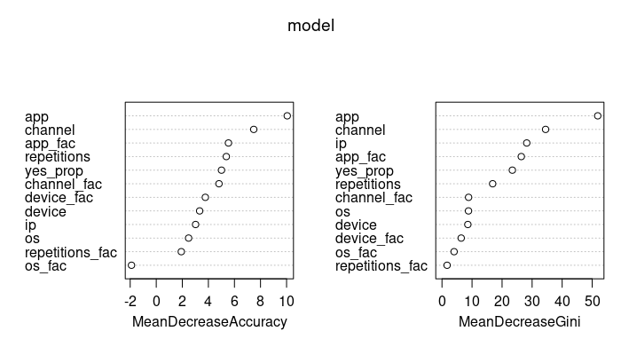

# Predictions whether a user will download an app after clicking a mobile app advertisement in R
<center> <h3>Diogo F. dos Santos</h3> </center>
<center><h4>August 9th, 2020</h4></center>

## PART ONE
[ssssssssssXXXXXXXXXXXXXXXXX](Project_click_fraud_1_web.md)
### Data fields

Each row of the training data contains a click record, with the following features:

* ip: ip address of click.
* app: app id for marketing.
* device: device type id of user mobile phone (e.g., iphone 6 plus, iphone 7, huawei mate 7, etc.)
* os: os version id of user mobile phone
* channel: channel id of mobile ad publisher
* click_time: timestamp of click (UTC)
* attributed_time: if user download the app for after clicking an ad, this is the time of the app download
* is_attributed: the target that is to be predicted, indicating the app was downloaded
Note that ip, app, device, os, and channel are encoded.

Problem: Predict the is_attributed features

Data set site: https://www.kaggle.com/c/talkingdata-adtracking-fraud-detection/data

Language: R

The solution to this problem was divided into four parts. The first part is 
in this script. It deals with the data munging and the testing of many machine
learning models using the train_sample.csv file and testing with 1E+07 rows of 
the train.csv. The data of this file was used as the test dataset because the 
dataset provided did not have the target variable.

The second part of the solution got the main tidying lines of part one to tidy 
the full training dataset, nominated train.csv. In the third part, the tidying 
training dataset was taken with the best model acquired in part one to train 
the model, but the number of the trees of the random forest model was reduced 
due to my notebook capacity. In the fourth part, the trained model was applied 
to the provided test dataset, test.csv. Afterward, the predicted results were 
matched with the click_id to produce the submission file.

``` r
# Removes all existing objects and packages from the current workspace
rm(list = ls())
# Working directory 
# setwd("~/Documents/learning_Data_Science/R_learnings/Project_1_in_R")
# getwd()

# Packages
library(dplyr)
library(lubridate)
library(ggplot2)
library(ggthemes)
library(mltools)
library(data.table)
library(caret)
library(ROCR) 
library(knitr)
library(rmarkdown)
```



``` r
# Read the data sets
train_set <- read.csv(file = 'train_sample.csv', header = T)
#test_set <- fread(file = 'test.csv', header = T)

# The train dataset named train.csv can be found on the web site
# https://www.kaggle.com/c/talkingdata-adtracking-fraud-detection/data
test_set <- fread(file = 'train.csv', header = T, nrows = 1e7)
```
## PART ONE

This script got the main tidying lines of part one to tidy the full 
training dataset, nominated train.csv.

``` r
# Removes all existing objects and packages from the current workspace
rm(list = ls())
# Working directory 
# setwd("~/project1")
# getwd()

# Packages
library(dplyr)
library(data.table)
library(caret)
library(randomForest)
library(DMwR)
```

Number of rows in the train dataset
The train dataset named train.csv can be found on the web site
https://www.kaggle.com/c/talkingdata-adtracking-fraud-detection/data
``` r
n_rows <- fread(file = 'train.csv', header = T, select = 'is_attributed')
n_rows <- nrow(n_rows)
n_rows    # 184.903.890 rows
## [1] 184903890
gc()
##            used  (Mb) gc trigger   (Mb)  max used   (Mb)
## Ncells  3023909 161.5   14360160  767.0  22293634 1190.7
## Vcells 20116531 153.5  379220964 2893.3 508565428 3880.1
``` r
Calculating the number of batches
``` r
for (i in c(15:100)) {
  if (n_rows%%i == 0) {
    print(c(i, n_rows/i))
  }
}             # 15 seems better for my computer capacity
## [1]       15 12326926
## [1]      30 6163463
## [1]      73 2532930

rm(i)
``` r

Batches
``` r
n = 15
train_set <- data.frame(is_attributed = c(),
                        app = c(),
                        channel = c(),
                        repetitions_fac = c(),
                        app_fac = c())
```
The training dataset transformation
``` r
for (i in c(0:(n-1))) {
  if (i == 0) {
    # The train dataset named train.csv can be found on the web site
    # https://www.kaggle.com/c/talkingdata-adtracking-fraud-detection/data
    train <- fread(file = 'train.csv', header = T, 
                 skip = n_rows/n*i, nrows = n_rows/n,
                  select = c('is_attributed', 'ip', 'app', 'channel'))
                 } else {
    train <- fread(file = 'train.csv', header = F, 
                   skip = n_rows/n*i, nrows = n_rows/n,
                   select = c(8,1,2,5))
    names(train) <- c('is_attributed', 'ip', 'app', 'channel')
  }
 
  # ip feature
  # Repeated ips in order
  n_dupl_ips <- train %>%
    count(ip, wt = n(), name = 'repetitions') %>%
    arrange(desc(repetitions))
  
  # Number of duplicate ips column
  train <- left_join(train, n_dupl_ips, by = 'ip')
  train$ip <- NULL
  
  # repetitions classes
  train$repetitions_fac <- cut(train$repetitions,
                               breaks = c(0,5,nrow(train)), 
                               labels = c(1, 2))
  train$repetitions <- NULL
  
  # app classes
  train$app_fac <- cut(train$app,
                       breaks = c(0, 3, 12, 18, nrow(train)),
                       right = F, labels = c(1, 2, 3, 4))
  
  # is_attributed classes
  train <- train %>%
    mutate(is_attributed = factor(is_attributed, levels = c(1,0)))
  head(train_set)
  
  # Balancing the target class
  train <- SMOTE(is_attributed ~ ., data  = train)
  
  # Binding the train dataset
  train_set <- rbind(train_set, train)
  
  rm(n_dupl_ips, train)
  gc()
  print(i)
}

dim(train_set)
table(train_set$is_attributed) 
```

Saving the tidy train dataset 
``` r
write.csv(x = train_set, file = 'train_set.csv')
``` r

#### Continue on part three, filename project_click_fraud_3_predictions_with_the_test_dataset.R
