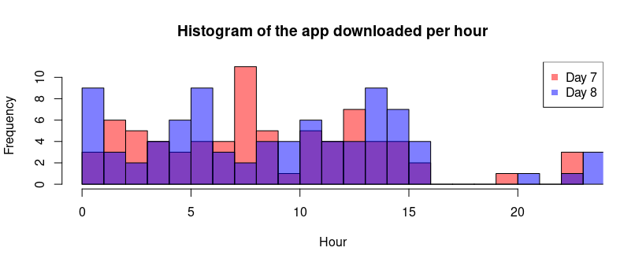

# Predictions whether a user will download an app after clicking a mobile app advertisement in R
<center> <h3>Diogo F. dos Santos</h3> </center>
<center><h4>August 9th, 2020</h4></center>

## PART ONE

### Data fields

Each row of the training data contains a click record, with the following features:

* ip: ip address of click.
* app: app id for marketing.
* device: device type id of user mobile phone (e.g., iphone 6 plus, iphone 7, huawei mate 7, etc.)
* os: os version id of user mobile phone
* channel: channel id of mobile ad publisher
* click_time: timestamp of click (UTC)
* attributed_time: if user download the app for after clicking an ad, this is the time of the app download
* is_attributed: the target that is to be predicted, indicating the app was downloaded
Note that ip, app, device, os, and channel are encoded.

Problem: Predict the is_attributed features

Data set site: https://www.kaggle.com/c/talkingdata-adtracking-fraud-detection/data

Language: R

The solution to this problem was divided into four parts. The first part is 
in this script. It deals with the data munging and the testing of many machine 
learning models using the train_sample.csv file and testing with 1E+07 rows of 
the train.csv. The data of this file was used as the test dataset because the 
dataset provided did not have the target variable.

The second part of the solution got the main tidying lines of part one to tidy 
the full training dataset, nominated train.csv. In the third part, the tidying 
training dataset was taken with the best model acquired in part one to train 
the model, but the number of the trees of the random forest model was reduced 
due to my notebook capacity. In the fourth part, the trained model was applied 
to the provided test dataset, test.csv. Afterward, the predicted results were 
matched with the click_id to produce the submission file.

``` r
# Removes all existing objects and packages from the current workspace
rm(list = ls())
# Working directory 
# setwd("~/Documents/learning_Data_Science/R_learnings/Project_1_in_R")
# getwd()

# Packages
library(dplyr)
library(lubridate)
library(ggplot2)
library(ggthemes)
library(mltools)
library(data.table)
library(caret)
library(ROCR) 
library(knitr)
library(rmarkdown)
```

``` r
# Read the data sets
train_set <- read.csv(file = 'train_sample.csv', header = T)
#test_set <- fread(file = 'test.csv', header = T)

# The train dataset named train.csv can be found on the web site
# https://www.kaggle.com/c/talkingdata-adtracking-fraud-detection/data
test_set <- fread(file = 'train.csv', header = T, nrows = 1e7)
```
### Exploratory data analysis

``` r
# Missing values

any(is.na(train_set))
## [1] FALSE

any(is.na(test_set))
## [1] FALSE

# Overview
dim(train_set)
## [1] 100000   8

head(train_set)
##       ip app device os channel          click_time attributed_time is_attributed
## 1  87540  12      1 13     497 2017-11-07 09:30:38                             0
## 2 105560  25      1 17     259 2017-11-07 13:40:27                             0
## 3 101424  12      1 19     212 2017-11-07 18:05:24                             0
## 4  94584  13      1 13     477 2017-11-07 04:58:08                             0
## 5  68413  12      1  1     178 2017-11-09 09:00:09                             0
## 6  93663   3      1 17     115 2017-11-09 01:22:13                             0

str(train_set)
## 'data.frame':
## 100000 obs. of 8 variables:
## $ ip             : int 87540 105560 101424 94584 68413 93663 17059 121505 192967 143636 ...
## $ app            : int 12 25 12 13 12 3 1 9 2 3 ...
## $ device         : int 1 1 1 1 1 1 1 1 2 1 ...
## $ os             : int 13 17 19 13 1 17 17 25 22 19 ...
## $ channel        : int 497 259 212 477 178 115 135 442 364 135 ...
## $ click_time     : chr "2017-11-07 09:30:38" "2017-11-07 13:40:27" "2017-11-07 18:05:24" "2017-11-0
## $ attributed_time: chr "" "" "" "" ...
## $ is_attributed  : int 0 0 0 0 0 0 0 0 0 0 ...

dim(test_set)
## [1] 10000000    8

head(test_set)
##        ip app device os channel          click_time attributed_time is_attributed
## 1:  83230   3      1 13     379 2017-11-06 14:32:21                             0
## 2:  17357   3      1 19     379 2017-11-06 14:33:34                             0
## 3:  35810   3      1 13     379 2017-11-06 14:34:12                             0
## 4:  45745  14      1 13     478 2017-11-06 14:34:52                             0
## 5: 161007   3      1 13     379 2017-11-06 14:35:08                             0
## 6:  18787   3      1 16     379 2017-11-06 14:36:26                             0

str(test_set)
Classes ‘data.table’ and 'data.frame':	10000000 obs. of  8 variables:
## $ ip             : int  83230 17357 35810 45745 161007 18787 103022 114221 165970 74544 ...
## $ app            : int  3 3 3 14 3 3 3 3 3 64 ...
## $ device         : int  1 1 1 1 1 1 1 1 1 1 ...
## $ os             : int  13 19 13 13 13 16 23 19 13 22 ...
## $ channel        : int  379 379 379 478 379 379 379 379 379 459 ...
## $ click_time     : chr  "2017-11-06 14:32:21" "2017-11-06 14:33:34" "2017-11-06 14:34:12" "2017-11-06 14:34:52" ...
## $ attributed_time: chr  "" "" "" "" ...
## $ is_attributed  : int  0 0 0 0 0 0 0 0 0 0 ...

# The target variable is categorical
train_set$is_attributed <- as.factor(train_set$is_attributed)
test_set$is_attributed <- as.factor(test_set$is_attributed)
table(train_set$is_attributed)
# table(test_set$is_attributed)
##     0     1 
## 99773   227 
                                        # It has other categorical ip, variables,
                                        # like the app, device, os, and channel, 
                                        # but it seems to be not practical to 
                                        # convert these variables at this time.

# Train dataset summary
summary(train_set)
##       ip              app             device              os            channel     
## Min.   :     9   Min.   :  1.00   Min.   :   0.00   Min.   :  0.00   Min.   :  3.0  
## 1st Qu.: 40552   1st Qu.:  3.00   1st Qu.:   1.00   1st Qu.: 13.00   1st Qu.:145.0  
## Median : 79827   Median : 12.00   Median :   1.00   Median : 18.00   Median :258.0  
## Mean   : 91256   Mean   : 12.05   Mean   :  21.77   Mean   : 22.82   Mean   :268.8  
## 3rd Qu.:118252   3rd Qu.: 15.00   3rd Qu.:   1.00   3rd Qu.: 19.00   3rd Qu.:379.0  
## Max.   :364757   Max.   :551.00   Max.   :3867.00   Max.   :866.00   Max.   :498.0  
##  click_time        attributed_time    is_attributed
## Length:100000      Length:100000      0:99773      
## Class :character   Class :character   1:  227      
## Mode  :character   Mode  :character   
 
summary(test_set)
##       ip              app             device              os           channel     
## Min.   :     9   Min.   :  0.00   Min.   :   0.00   Min.   :  0.0   Min.   :  0.0  
## 1st Qu.: 42164   1st Qu.:  3.00   1st Qu.:   1.00   1st Qu.: 13.0   1st Qu.:134.0  
## Median : 81973   Median : 12.00   Median :   1.00   Median : 18.0   Median :237.0  
## Mean   : 87332   Mean   : 12.86   Mean   :  33.04   Mean   : 24.6   Mean   :252.7  
## 3rd Qu.:121187   3rd Qu.: 15.00   3rd Qu.:   1.00   3rd Qu.: 19.0   3rd Qu.:377.0  
## Max.   :212774   Max.   :675.00   Max.   :3545.00   Max.   :745.0   Max.   :498.0  
##  click_time        attributed_time    is_attributed
## Length:10000000    Length:10000000    0:9981283    
## Class :character   Class :character   1:  18717    
## Mode  :character   Mode  :character  

# Unique values of the ip feature
length(unique(train_set$ip))        # 34857 values in 100000 of the total.
## [1] 34857

length(unique(test_set$ip))         # 93936 values in 18790469 of the total.
## [1] 68740

head(rev(sort(table(train_set$ip))))
##  5348   5314  73487  73516  53454 114276 
##   669    616    439    399    280    219 

head(rev(sort(table(test_set$ip))))
## 73516  73487   5314   5348  53454 105560 
## 51711  51215  35073  35004  25381  23289 
                                    # Waw!!! It has many ip repetitions.
                                    # I thought it had had much less than that.
                                    # Some ips have so many repetitions that
                                    # I think I will have to make classes to
                                    # compute this dependency and analyze if
                                    # the target variable has a strong 
                                    # dependency on the ip variable.
                                    # Maybe classes depending on the number 
                                    # of repetitions.
```

``` r
# Duplicated ips
dupl_ips_train <- train_set[duplicated(train_set$ip), 1]
length(dupl_ips_train)
## [1] 65143

length(unique(dupl_ips_train))
## [1] 17434

round(prop.table(table(train_set$is_attributed[train_set$ip %in% 
                                unique(dupl_ips_train)])) * 100, 2)
##     0     1 
## 99.91  0.09 

dupl_ips_test <- train_set[duplicated(test_set$ip), 1]
length(dupl_ips_test)
## [1] 9931260

length(unique(dupl_ips_test))
## [1] 32051

round(prop.table(table(train_set$is_attributed[train_set$ip %in% 
                                unique(dupl_ips_test)])) * 100, 2)
##    0    1 
## 99.8  0.2 

# Repeated ips in order
n_dupl_ips_train <- train_set %>%
  count(ip, wt = n() ) %>%
  arrange(desc(n))

head(n_dupl_ips_train)
##       ip   n
## 1   5348 669
## 2   5314 616
## 3  73487 439
## 4  73516 399
## 5  53454 280
## 6 114276 219

n_dupl_ips_test <- test_set %>%
  count(ip, wt = n() ) %>%
  arrange(desc(n))

head(n_dupl_ips_test)
##        ip     n
## 1:  73516 51711
## 2:  73487 51215
## 3:   5314 35073
## 4:   5348 35004
## 5:  53454 25381
## 6: 105560 23289

# Verifyind the total of lines
sum(n_dupl_ips_train$n)
## [1] 100000

sum(n_dupl_ips_test$n)
## [1] 10000000

# Number of duplicate ips column
train_set <- left_join(train_set, n_dupl_ips_train, by = 'ip')
head(train_set)
##       ip app device os channel          click_time attributed_time is_attributed   n
## 1  87540  12      1 13     497 2017-11-07 09:30:38                             0   8
## 2 105560  25      1 17     259 2017-11-07 13:40:27                             0 149
## 3 101424  12      1 19     212 2017-11-07 18:05:24                             0   2
## 4  94584  13      1 13     477 2017-11-07 04:58:08                             0   3
## 5  68413  12      1  1     178 2017-11-09 09:00:09                             0   4
## 6  93663   3      1 17     115 2017-11-09 01:22:13                             0   2

test_set <- left_join(test_set, n_dupl_ips_test, by = 'ip')
head(test_set)
##        ip app device os channel          click_time attributed_time is_attributed    n
## 1:  83230   3      1 13     379 2017-11-06 14:32:21                             0 1327
## 2:  17357   3      1 19     379 2017-11-06 14:33:34                             0 1057
## 3:  35810   3      1 13     379 2017-11-06 14:34:12                             0  449
## 4:  45745  14      1 13     478 2017-11-06 14:34:52                             0 9395
## 5: 161007   3      1 13     379 2017-11-06 14:35:08                             0  184
## 6:  18787   3      1 16     379 2017-11-06 14:36:26                             0  205

# Rename the n columns
names(train_set)[9] <- 'repetitions'
labels(train_set)[[2]]
## [1] "ip"              "app"             "device"          "os"              "channel"        
## [6] "click_time"      "attributed_time" "is_attributed"   "repetitions"    

names(test_set)[9] <- 'repetitions'
# names(test_set)[8] <- 'repetitions'
labels(test_set)[[2]]
## [1] "ip"              "app"             "device"          "os"              "channel"        
## [6] "click_time"      "attributed_time" "is_attributed"   "repetitions"  

# The number of ips repeated depending on the number of repetitions
c = 1
values <- unique(n_dupl_ips_train$n)
df <- data.frame(repetitions = rep(NA, length(values)))

for (i in values) {
  df$repetitions[c] <- i
  tab <- table(train_set$is_attributed[train_set$repetitions == i])
  df$no[c] <- tab[1]
  df$no_prop[c] <- round(tab[1] * 100 / sum(tab), 2)
  df$yes[c] <- tab[2]
  df$yes_prop[c] <- round(tab[2] * 100 / sum(tab), 2)
  c = c + 1
}

# Verifying the number rows of  train data set is correct
sum(df$no, df$yes)
## [1] 100000

# Filter and sorting df in relation to the proportion of yes to the app
df_prop <- df %>% 
  filter(yes_prop > 0) %>%
  arrange(desc(yes_prop))

df_prop
##    repetitions    no no_prop yes yes_prop
## 1           41    40   97.56   1     2.44
## 2            1 17273   99.14 150     0.86
## 3          137   136   99.27   1     0.73
## 4           70   139   99.29   1     0.71
## 5           42   167   99.40   1     0.60
## 6          616   613   99.51   3     0.49
## 7          669   666   99.55   3     0.45
## 8           18   377   99.74   1     0.26
## 9           12  1891   99.74   5     0.26
## 10          19   512   99.81   1     0.19
## 11           2 14153   99.82  25     0.18
## 12          14  1244   99.84   2     0.16
## 13          16   671   99.85   1     0.15
## 14           5  5996   99.85   9     0.15
## 15           8  3701   99.92   3     0.08
## 16          13  1481   99.93   1     0.07
## 17           9  3265   99.94   2     0.06
## 18           4  7923   99.94   5     0.06
## 19           3 10826   99.94   7     0.06
## 20          11  2199   99.95   1     0.05
## 21           7  4128   99.95   2     0.05
## 22          10  2649   99.96   1     0.04
## 23           6  4913   99.98   1     0.02
```
#### Scatter plot of the yes or no downloading app depending on the repeated ips
``` r
brks <- cut(df_prop$repetitions, breaks = c(0, 5, 10, 100, 700))
ggplot(data = df_prop) +
  geom_point(aes(no/1000, yes, color = brks,
                 size = yes_prop), alpha = 0.8) +
  xlab('no (x10³)') +
  scale_color_manual(values = c(1,3,2,4)) +
  scale_size(breaks = c(0.5, 1, 2)) +
  coord_trans(x = 'log', y = 'log') +
  ggtitle('The app was downloaded') +
  theme_linedraw()
```


### Scatter plots of the yes/no downloading app and the number of ips repetitions 
``` r
ggplot(data = df_prop) +
  geom_point(aes(repetitions, yes_prop, size = yes_prop), alpha = 0.8) +
  scale_color_manual(values = c(1,3,2,4)) +
  scale_size(breaks = c(0.5, 1, 2)) +
  coord_trans(x = 'log') +
  ggtitle('The app was downloaded') +
  theme_linedraw()
                                    # the yes proportions seems to behave like
                                    # a sinusoid
```


``` r
# Iserting anoter columns according to the yes_prop values
gt <- df_prop$repetitions[df_prop$yes_prop > 0.4]

train_set <- train_set %>% 
  mutate(yes_prop = ifelse(repetitions %in% gt, 1, 0))
                                    # I forget that did not have the 
                                    # is_attributed features in test data set.
                                    # I will make classes for repititions 
                                    # feature.

# repetitions classes
train_set$repetitions_fac <- cut(train_set$repetitions, 
                                 breaks = c(0,5,nrow(train_set)), 
                                 labels = c(1, 2))

test_set$repetitions_fac <- cut(test_set$repetitions, 
                                 breaks = c(0,5,nrow(test_set)), 
                                 labels = c(1, 2))

#########  TIME VARIABLE  ##################

# The click_time feature of the train data set
train_set$click_time <- as.Date(train_set$click_time, format = '%Y-%m-%d')
unique(months(train_set$click_time))      # only in november
## [1] "novembro"

unique(year(train_set$click_time))        # only in 2017
## [1] 2017

unique(day(train_set$click_time))         # the days are between 6 and 9
## [1] 7 9 8 6

unique(weekdays(train_set$click_time))
## [1] "terça"   "quinta"  "quarta"  "segunda"
                                          # days 6 = Monday, 7 = Tuesday,
                                          #      8 = Wednesday, and 9 = Thursday

# The click_time feature of the test data set
test_set$click_time <- as.Date(test_set$click_time, format = '%Y-%m-%d')
unique(months(test_set$click_time))       # only in november
## [1] "novembro"

unique(year(test_set$click_time))         # only in 2017
## [1] 2017

unique(day(test_set$click_time))          # only the day 10th
## [1] 6 7

unique(weekdays(test_set$click_time))     # day  10 = friday
## [1] "segunda" "terça"

# New feature containing the day of the click_time
train_set$click_day <- day(train_set$click_time)
test_set$click_day <- day(test_set$click_time)
```

### Train click_day plots
``` r
ggplot(train_set, aes(click_day)) +
  geom_histogram(binwidth = 1, fill = 'green', col = 'black', alpha = 0.6) +
  theme_bw()
                                          # maybe the day 6 has only the 
                                          # partial data
```


``` r
# Number of clicks in function of the day (train)
train_set %>%
  count(click_day)
##   click_day     n
## 1         6  5011
## 2         7 32393
## 3         8 34035
## 4         9 28561

# The train attributed_time feature. It is not in the test data set.
train_set$attributed_time <- ymd_hms(train_set$attributed_time)

# New features containing the day and hour of the train attributed_time
train_set$attributed_day <- day(train_set$attributed_time)
train_set$attributed_hour <- hour(train_set$attributed_time) + 
  ifelse(minute(train_set$attributed_time) >= 30, 1, 0)
```

``` r
ggplot(train_set, aes(attributed_day, attributed_hour, 
                      fill = cut(attributed_hour, breaks = c(0,12,18,24)))) +
  geom_bar(stat = "identity", alpha = 0.6)
```


``` r
# Number of clicks in function of the day (train)
train_set %>%
  count(attributed_day)
                                          # As shown in the last results, days 6 
                                          # and 9 have fewer observations than
                                          # the other days. It seems that the 
                                          # observations of the day 6 were in 
                                          # the final of the afternoon and 
                                          # day 9 until the middle of the 
                                          # afternoon. I will eliminate the 
                                          # day 6 and 9 to have two entire days.
                                          # This data set dos not have much
                                          # positive targets. I will not
                                          # delete the day 6 and 9.
##   attributed_day     n
## 1              6     4
## 2              7    76
## 3              8    85
## 4              9    62
## 5             NA 99773

# Erase the day 6 and 9 to have two entire days (train)
# train_set <- train_set[train_set$click_day != 6 & train_set$click_day != 9, ]
# dim(train_set)
```

### Hour of the day that the app was downloaded
``` r
hist(train_set$attributed_hour[train_set$attributed_day == 7], 
     col = rgb(1,0,0,0.5), breaks = 24,
     main = 'Histogram of the app downloaded per hour', xlab = 'Hour')
hist(train_set$attributed_hour[train_set$attributed_day == 8], 
     col = rgb(0,0,1,0.5), breaks = 24, add = T)
legend(x = "topright", legend = c('Day 7','Day 8'), 
       col = c(rgb(1,0,0,0.5), rgb(0,0,1,0.5)), pch = 15)
```


``` r
hist(train_set$attributed_hour, 
     breaks = 24, main = 'Histogram of the app downloaded per hour in the two days', 
     xlab = 'Hour')
                                          # Strangely, the number of downloads
                                          # has a great decrease after 16 hours
```


``` r
# app feature
sort(unique(train_set$app))
##   [1]   1   2   3   4   5   6   7   8   9  10  11  12  13  14  15  16  17  18  19  20  21  22  23
##  [24]  24  25  26  27  28  29  30  31  32  33  34  35  36  37  38  39  42  43  44  45  46  47  48
##  [47]  49  50  52  53  54  55  56  58  59  60  61  62  64  65  66  67  68  70  71  72  74  75  76
##  [70]  78  79  80  81  82  83  84  85  86  87  88  91  92  93  94  95  96  97  99 100 101 103 104
##  [93] 105 107 108 109 110 112 115 116 117 118 119 121 122 123 124 125 133 134 137 139 145 146 148
## [116] 149 150 151 158 160 161 163 165 168 170 171 176 181 183 190 192 202 204 208 215 216 232 233
## [139] 261 266 267 268 271 273 293 302 310 315 347 363 372 394 398 407 425 474 486 536 538 548 551

sort(unique(test_set$app))
##   [1]   0   1   2   3   4   5   6   7   8   9  10  11  12  13  14  15  16  17  18  19  20  21  22
##  [24]  23  24  25  26  27  28  29  32  33  34  35  36  37  38  39  40  42  43  44  45  46  47  48
##  [47]  49  50  51  52  53  54  55  56  57  58  59  60  61  62  64  65  66  67  68  69  70  71  72
##  [70]  73  74  75  76  77  78  79  80  81  82  83  84  85  86  87  88  89  90  91  93  94  95  96
##  [93]  97  98  99 100 101 102 103 104 105 107 108 109 110 111 112 114 115 116 118 119 120 121 122
## [116] 123 124 125 126 127 128 130 132 133 134 136 137 140 141 142 143 145 146 148 149 150 151 152
## [139] 153 154 155 158 159 160 161 162 163 165 166 167 168 169 170 171 172 173 175 176 177 181 182
## [162] 183 184 185 186 188 190 192 193 194 195 196 197 198 199 202 203 205 206 207 208 209 210 212
## [185] 213 215 216 217 218 220 222 223 224 226 229 230 231 232 233 236 237 238 239 240 241 242 244
## [208] 246 247 249 250 251 255 256 257 258 259 261 262 263 265 266 267 268 269 272 273 276 277 278
## [231] 279 280 281 283 284 286 288 289 290 291 292 294 295 299 302 303 304 305 310 312 315 317 318
## [254] 319 320 322 324 325 326 328 329 333 334 336 346 347 349 352 354 355 361 362 363 365 366 367
## [277] 371 372 376 379 381 383 386 394 395 398 399 407 419 425 429 433 436 443 446 448 469 474 480
## [300] 481 484 489 496 502 525 530 531 536 537 538 540 541 549 551 553 555 556 557 561 563 564 565
## [323] 569 576 610 612 619 625 629 645 651 675

div_app<- bin_data(c(train_set$app, test_set$app), bins = 4, binType = "quantile")
levels(div_app)
## [1] "[0, 3)"    "[3, 12)"   "[12, 15)"  "[15, 675]"

train_set$app_fac <- cut(train_set$app, breaks = c(0, 3, 12, 18, nrow(train_set)), 
                     right = F, labels = c(1, 2, 3, 4))

test_set$app_fac <- cut(test_set$app, breaks = c(0, 3, 12, 18, nrow(test_set)), 
                     right = F, labels = c(1, 2, 3, 4))
```

``` r
plot(train_set$app_fac, xlab = 'App id class (train data set)', ylab = 'Frequency')
```


``` r
plot(test_set$app_fac, xlab = 'App id class (test data set)', ylab = 'Frequency')
```


``` r
# device feature
sort(unique(train_set$device))
##  [1]    0    1    2    4    5    6    7    9   11   16   17   18   20   21   25   30   33   36
## [19]   37   40   49   50   53   56   58   59   60   67   74   76   78   79   97  100  102  103
## [37]  106  109  114  116  124  129  154  160  163  167  180  182  188  196  202  203  210  211
## [55]  220  241  268  291  321  329  347  351  362  374  385  386  414  420  486  516  549  552
## [73]  558  579  581  596  607  657  828  883  928  957 1042 1080 1162 1318 1422 1482 1728 1839
## [91] 2120 2429 2980 3032 3282 3331 3543 3545 3866 3867

sort(unique(test_set$device))
##   [1]    0    1    2    4    6    7    8    9   10   11   13   14   15   16   17   18   19   20
##  [19]   21   22   23   24   25   26   27   28   29   30   31   32   33   34   35   36   37   38
##  [37]   39   40   42   43   44   45   46   48   49   50   51   52   53   54   56   57   58   59
##  [55]   60   61   62   63   64   65   66   67   68   70   71   72   73   74   75   76   77   78
##  [73]   79   80   81   82   83   84   86   88   89   90   92   93   94   95   96   97   99  100
##  [91]  101  102  103  104  105  106  107  108  109  110  112  113  114  115  116  118  119  122
## [109]  123  124  126  127  128  129  130  131  132  133  134  136  137  138  140  141  142  144
## [127]  145  146  147  148  149  150  151  152  153  154  155  156  157  159  160  161  162  163
## [145]  164  165  166  167  168  169  170  171  172  173  174  175  177  179  180  181  183  184
## [163]  185  186  187  188  189  190  191  192  194  195  196  197  199  200  201  202  203  204
## [181]  205  ...

summary(train_set$device)
##   Min. 1st Qu.  Median    Mean 3rd Qu.    Max. 
##   0.00    1.00    1.00   21.77    1.00 3867.00 

summary(test_set$device)
##   Min. 1st Qu.  Median    Mean 3rd Qu.    Max. 
##   0.00    1.00    1.00   33.04    1.00 3545.00 
```

``` r
hist(train_set$device, freq = F, breaks = 40, col = rgb(1,0,0,0.5),
     main = 'Device histograms', xlab = 'Devices')
hist(test_set$device, freq = F, breaks = 40, col = rgb(0,0,1,0.5), add = T)
legend(x = "topright", legend = c('Train data set','Test data set'), 
       col = c(rgb(1,0,0,0.5), rgb(0,0,1,0.5)), pch = 15)
```


``` r
a <- train_set %>%
  count(device, sort = T)
head(a)
##   device     n
## 1      1 94338
## 2      2  4345
## 3      0   541
## 4   3032   371
## 5   3543   151
## 6   3866    93

b <- test_set %>%
  count(device, sort = T)
head(b)
##    device       n
## 1:      1 9381146
## 2:      2  456617
## 3:   3032  104393
## 4:      0   46476
## 5:     59    1618
## 6:     40     462

# Type 1 device proportion
( a[1,2]/sum(a) )                       # ~58% of all devices are of type 1
## [1] 0.5842556

( b[1,2]/sum(b) )                       # ~86% of all devices are of type 1
##            n
## 1: 0.8574944

# Making two classes of devices: one for type 1 and the other for the others
class_device <- function(x) {ifelse(x == 1, 1, 2)} 

train_set$device_fac <- as.factor(class_device(train_set$device))
levels(train_set$device_fac)
## [1] "1" "2"

test_set$device_fac <- as.factor(class_device(test_set$device))
levels(test_set$device_fac)
## [1] "1" "2"

# OS feature
sort(unique(train_set$os))
##   [1]   0   1   2   3   4   5   6   7   8   9  10  11  12  13  14  15  16  17  18  19  20  21  22
##  [24]  23  24  25  26  27  28  29  30  31  32  34  35  36  37  38  39  40  41  42  43  44  45  46
##  [47]  47  48  49  50  52  53  55  56  57  58  59  60  61  62  63  64  65  66  67  68  69  70  71
##  [70]  73  74  76  77  78  79  80  81  83  84  85  87  88  90  92  96  97  98  99 100 102 106 107
##  [93] 108 109 110 111 112 113 114 116 117 118 127 129 132 133 135 137 138 142 151 152 153 155 168
## [116] 172 174 178 184 185 192 193 196 198 199 207 607 748 836 866

sort(unique(test_set$os))
##   [1]   0   1   2   3   4   5   6   7   8   9  10  11  12  13  14  15  16  17  18  19  20  21  22
##  [24]  23  24  25  26  27  28  29  30  31  32  34  35  36  37  38  39  40  41  42  43  44  45  46
##  [47]  47  48  49  50  52  53  54  55  56  57  58  59  60  61  62  63  64  65  66  67  68  69  70
##  [70]  71  72  73  74  75  76  77  78  79  80  81  83  84  85  86  87  88  89  90  91  92  93  94
##  [93]  95  96  97  98  99 100 101 102 103 104 105 106 107 108 109 110 111 112 113 114 115 117 118
## [116] 119 120 123 124 125 126 127 128 129 130 132 133 134 135 136 137 138 140 141 142 143 145 146
## [139] 147 148 149 150 151 152 153 155 156 158 159 160 161 162 164 168 169 171 172 173 174 175 177
## [162] 178 183 184 185 188 190 192 193 196 197 198 207 208 209 213 214 215 216 217 219 223 226 228
## [185] 229 231 234 236 237 241 243 244 245 248 250 251 252 254 255 256 260 261 262 265 268 272 274
## [208] 277 280 284 286 294 297 300 302 305 306 325 326 329 336 338 342 346 355 380 404 407 408 411
## [231] 414 421 438 465 505 508 512 514 531 541 552 559 566 573 584 602 603 607 610 612 616 617 619
## [254] 620 622 630 636 640 645 647 649 651 653 656 657 669 672 675 681 684 686 687 688 690 692 700
## [277] 701 702 704 705 707 712 715 716 726 736 737 739 742 743 744 745

summary(train_set$os)
##   Min. 1st Qu.  Median    Mean 3rd Qu.    Max. 
##   0.00   13.00   18.00   22.82   19.00  866.00 

summary(test_set$os)
##   Min. 1st Qu.  Median    Mean 3rd Qu.    Max. 
##    0.0    13.0    18.0    24.6    19.0   745.0 
```

``` r
# histograms
hist(train_set$os, freq = F, xlim = c(0,800), ylim = c(0, 0.07), breaks = 100, 
     col = rgb(1,0,0,0.5), main = 'OS histograms', xlab = 'OS id')
hist(test_set$os, freq = F, xlim = c(0,800), breaks = 50,
     col = rgb(0,0,1,0.5), add = T)
legend(x = "topright", legend = c('Train data set','Test data set'), 
       col = c(rgb(1,0,0,0.5), rgb(0,0,1,0.5)), pch = 15)
```


``` r
# smaller domain
hist(train_set$os, freq = F, xlim = c(0, 100), ylim = c(0, 0.07), breaks = 100, 
     col = rgb(1,0,0,0.5), main = 'OS histograms', xlab = 'OS id')
hist(test_set$os, freq = F, xlim = c(0,100), breaks = 50,
     col = rgb(0,0,1,0.5), add = T)
legend(x = "topright", legend = c('Train data set','Test data set'), 
       col = c(rgb(1,0,0,0.5), rgb(0,0,1,0.5)), pch = 15)
```


``` r
# Countings
a <- train_set %>%
  count(os, sort = T)
head(a)
##   os     n
## 1 19 23870
## 2 13 21223
## 3 17  5232
## 4 18  4830
## 5 22  4039
## 6 10  2816

b <- test_set %>%
  count(os, sort = T)
head(b)
##    os       n
## 1: 19 2410148
## 2: 13 2199778
## 3: 17  531695
## 4: 18  483602
## 5: 22  365576
## 6: 10  285907

# Type 19 and 13 os proportion
( (a[1,2] + a[2,2]) / sum(a) )
## [1] 0.4005952

( (b[1,2] + b[2,2]) / sum(b) )
##            n
## 1: 0.4577447
                                        # Type 19 and 13 os represent almost
                                        # 40% of the systems

# Making classes for os features
class_os <- function(x) {
  if (x == 13) {2}
  else if (x == 19) {3}
  else if (x > 19) {4}
  else {1}
}
```

``` r
train_set$os_fac <- as.factor(sapply(train_set$os, class_os))
plot(train_set$os_fac, xlab = 'OS classes (train data set)', ylab = 'Frequency')
```


``` r
test_set$os_fac <- as.factor(sapply(test_set$os, class_os))
plot(test_set$os_fac, xlab = 'OS classes (test data set)', ylab = 'Frequency')
```


``` r
# Channel feature
sort(unique(train_set$channel))
##   [1]   3   4   5  13  15  17  18  19  21  22  24  30 101 105 107 108 110 111 113 114 115 116 118
##  [24] 120 121 122 123 124 125 126 127 128 130 134 135 137 138 140 145 150 153 160 171 173 174 178
##  [47] 182 203 205 208 210 211 212 213 215 219 224 232 234 236 237 242 243 244 245 253 258 259 261
##  [70] 262 265 266 268 272 274 277 278 280 282 315 317 319 320 322 325 326 328 330 332 333 334 340
##  [93] 341 343 347 349 353 356 360 361 364 371 373 376 377 379 386 391 400 401 402 404 406 409 410
## [116] 411 412 416 417 419 420 421 424 430 435 439 442 445 446 448 449 450 451 452 453 455 456 457
## [139] 459 460 463 465 466 467 469 474 477 478 479 480 481 483 484 486 487 488 489 490 496 497 498

sort(unique(test_set$channel))
##   [1]   0   3   4   5  13  15  17  18  19  21  22  24  30 101 105 107 108 110 111 113 114 115 116
##  [24] 118 120 121 122 123 124 125 126 128 129 130 134 135 137 138 140 142 145 150 153 160 171 173
##  [47] 174 178 181 182 203 205 208 210 211 212 213 215 219 222 223 224 225 232 234 236 237 238 242
##  [70] 243 244 245 251 253 258 259 261 262 265 266 268 272 274 277 278 280 281 282 311 315 317 319
##  [93] 320 325 326 328 330 332 333 334 340 341 343 347 349 352 353 356 360 361 364 371 373 376 377
## [116] 379 386 391 400 401 402 406 407 409 410 411 412 414 416 417 419 420 421 424 430 435 439 442
## [139] 445 446 449 450 451 452 453 456 457 458 459 460 463 465 466 467 469 471 477 478 479 480 481
## [162] 483 484 486 487 488 489 496 497 498

summary(train_set$channel)
##   Min. 1st Qu.  Median    Mean 3rd Qu.    Max. 
##    3.0   145.0   258.0   268.8   379.0   498.0 
    
summary(test_set$channel)
##   Min. 1st Qu.  Median    Mean 3rd Qu.    Max. 
##    0.0   134.0   237.0   252.7   377.0   498.0 
```

``` r
# histograms
hist(train_set$channel, freq = F, ylim = c(0, 0.01), breaks = 20, 
     col = rgb(1,0,0,0.5), main = 'Channel histograms', xlab = 'Channel id')
hist(test_set$channel, freq = F, breaks = 20,
     col = rgb(0,0,1,0.5), add = T)
legend(x = "topright", legend = c('Train data set','Test data set'), 
       col = c(rgb(1,0,0,0.5), rgb(0,0,1,0.5)), pch = 15)
```


``` r
# Countings
a <- train_set %>%
  count(channel, sort = T)
head(a)
##   channel    n
## 1     280 8114
## 2     245 4802
## 3     107 4543
## 4     477 3960
## 5     134 3224
## 6     259 3130

b <- test_set %>%
  count(channel, sort = T)
head(b)
##    channel      n
## 1:     245 793105
## 2:     134 630888
## 3:     259 469845
## 4:     477 412559
## 5:     121 402226
## 6:     107 388035

#  Balancing the four channel classes
div_channel <- bin_data(c(train_set$channel, test_set$channel), 
                        bins = 4, binType = "quantile")
levels(div_channel)
## [1] "[0, 134)"   "[134, 242)" "[242, 377)" "[377, 498]"

train_set$channel_fac <- cut(train_set$channel, 
                             breaks = c(0, 135, 236, 401, nrow(train_set)),
                             right = F, labels = c(1, 2, 3, 4))

test_set$channel_fac <- cut(test_set$channel, 
                            breaks = c(0, 135, 236, 401, nrow(test_set)),
                            right = F, labels = c(1, 2, 3, 4))
```

``` r
plot(train_set$channel_fac, xlab = 'Channel id class (train data set)', 
     ylab = 'Frequency')
```


``` r
plot(test_set$channel_fac, xlab = 'Channel id class (test data set)', 
     ylab = 'Frequency')
```


``` r
# Features that does not contain missing values
dim(train_set)
## [1] 100000     18

any(is.na(train_set[,1:6]))
## [1] FALSE

any(is.na(train_set[,8:11]))
## [1] FALSE

any(is.na(train_set[,14:17]))
## [1] TRUE

# Dealing with the features with missing values
any(is.na(train_set[,7]))
[1] TRUE

labels(train_set)[[2]][7]
[1] "attributed_time"

head(unique(train_set$attributed_time))
## [1] NA                        "2017-11-08 02:22:38 UTC" "2017-11-08 06:10:37 UTC"
## [4] "2017-11-07 11:59:05 UTC" "2017-11-09 11:52:01 UTC" "2017-11-08 01:55:02 UTC"
                                        # This features will not be utilized

any(is.na(train_set[,12]))
## [1] FALSE

labels(train_set)[[2]][12]
## [1] "click_day"

unique(train_set$attributed_day)
## [1] NA  8  7  9  6
                                        # This features will not be utilized

any(is.na(train_set[,13]))
## [1] TRUE

labels(train_set)[[2]][13]
## [1] "attributed_day"

unique(train_set$attributed_hour)
## [1] NA  2  6 12 13 23  9  5 10 20  7  0  4  8 15 11  1 14 17  3 16 22 24 21
                                        # This features will not be utilized

# Reducing the quantity of not downloaded to balance the train target feature
n <- nrow(train_set[train_set$is_attributed == 1, ])
n
## [1] 227

train_no <- train_set %>%
  filter(is_attributed == 0) %>%
  slice_sample(n = n, replace = F)
nrow(train_no)
## [1] 227

train_yes <- train_set %>%
  filter(is_attributed == 1)
nrow(train_yes)
## [1] 227

train_set1 <- rbind(train_no, train_yes)
train_set1 <- train_set1 %>% 
  slice_sample(n = nrow(train_set1), replace = F)
nrow(train_set1)/2
## [1] 227

# Cleaning the house
rm(list = setdiff(ls(), c('train_set', 'train_set1', 'test_set')))
ls()
## [1] "test_set"   "train_set"  "train_set1"

gc()
##            used  (Mb) gc trigger   (Mb)  max used   (Mb)
## Ncells  2773749 148.2   13395887  715.5  20931072 1117.9
## Vcells 91570932 698.7  284414278 2170.0 284386939 2169.8
```

### Models


#### Logistic regression model

``` r
labels(test_set)[[2]]
##  [1] "ip"              "app"             "device"          "os"              "channel"        
##  [6] "click_time"      "attributed_time" "is_attributed"   "repetitions"     "repetitions_fac"
## [11] "click_day"       "app_fac"         "device_fac"      "os_fac"          "channel_fac"  

model1 <- glm(is_attributed ~ repetitions_fac + app_fac + 
                device_fac + os_fac + channel_fac, 
                data = train_set1, 
                family = "binomial")

# Summary of the model
summary(model1)
## Call:
## glm(formula = is_attributed ~ repetitions_fac + app_fac + device_fac + 
##     os_fac + channel_fac, family = "binomial", data = train_set1)
## 
## Deviance Residuals: 
##     Min       1Q   Median       3Q      Max  
## -2.6723  -0.5629   0.1194   0.6837   2.9808  
## 
## Coefficients:
##                  Estimate Std. Error z value Pr(>|z|)    
## (Intercept)      -16.8529   908.3027  -0.019  0.98520    
## repetitions_fac2  -1.3263     0.3062  -4.332 1.48e-05 ***
## app_fac2          16.4615   908.3027   0.018  0.98554    
## app_fac3          13.9896   908.3029   0.015  0.98771    
## app_fac4          18.1139   908.3027   0.020  0.98409    
## device_fac2        1.2064     0.4038   2.987  0.00281 ** 
## os_fac2            0.4697     0.4018   1.169  0.24234    
## os_fac3            0.5876     0.3694   1.590  0.11176    
## os_fac4            1.0746     0.3312   3.244  0.00118 ** 
## channel_fac2      -0.5142     0.3512  -1.464  0.14319    
## channel_fac3      -0.7106     0.3569  -1.991  0.04648 *  
## channel_fac4      -1.0198     0.4053  -2.516  0.01185 *  
## ---
## Signif. codes:  0 ‘***’ 0.001 ‘**’ 0.01 ‘*’ 0.05 ‘.’ 0.1 ‘ ’ 1
## 
## (Dispersion parameter for binomial family taken to be 1)
## 
##     Null deviance: 629.38  on 453  degrees of freedom
## Residual deviance: 375.36  on 442  degrees of freedom
## AIC: 399.36
## 
## Number of Fisher Scoring iterations: 16

# Predictions
predictions1 <- predict(model1, test_set, type="response")
predictions1 <- round(predictions1)

# Evaluation
confusionMatrix(as.factor(predictions1), 
                reference = test_set$is_attributed, positive = '1')
## Confusion Matrix and Statistics
## 
##           Reference
## Prediction       0       1
##          0 8697564    7841
##          1 1283719   10876***
##                                           
##                Accuracy : 0.8708          
##                  95% CI : (0.8706, 0.8711)
##     No Information Rate : 0.9981          
##     P-Value [Acc > NIR] : 1               
##                                           
##                   Kappa : 0.0129          
##                                           
## Mcnemar's Test P-Value : <2e-16          
##                                           
##             Sensitivity : 0.581076        
##             Specificity : 0.871387        
##          Pos Pred Value : 0.008401        
##          Neg Pred Value : 0.999099        
##              Prevalence : 0.001872        
##          Detection Rate : 0.001088        
##    Detection Prevalence : 0.129460        
##       Balanced Accuracy : 0.726232
##                                           
##        'Positive' Class : 1     

# ROC curve
predictions1_roc <- prediction(predictions1, test_set$is_attributed)
source("plot_utils.R") 
```

``` r
par(mfrow = c(1,2))
plot.roc.curve(predictions1_roc, title.text = "Curva ROC")
plot.pr.curve(predictions1_roc, title.text = "Curva Precision/Recall")
par(mfrow = c(1,1))
```


``` r
# Cleaning the house
rm(list = setdiff(ls(), c('train_set', 'train_set1', 'test_set')))
gc()
##            used  (Mb) gc trigger   (Mb)  max used   (Mb)
## Ncells  2617366 139.8   15670224  836.9  21334598 1139.4
## Vcells 95255761 726.8  298277460 2275.7 466058531 3555.8
```

#### Logistic regression model with the most significant variables

``` r
model2 <- glm(is_attributed ~ repetitions + device_fac + os_fac, 
              data = train_set1, 
              family = "binomial")

# Summary of the model
summary(model2)
## Call:
## glm(formula = is_attributed ~ repetitions + device_fac + os_fac, 
##     family = "binomial", data = train_set1)
## 
## Deviance Residuals: 
##     Min       1Q   Median       3Q      Max  
## -2.2010  -0.9890  -0.1636   1.1965   1.6394  
## 
## Coefficients:
##               Estimate Std. Error z value Pr(>|z|)    
## (Intercept) -0.5938732  0.1986416  -2.990  0.00279 ** 
## repetitions -0.0007266  0.0011634  -0.625  0.53226    
## device_fac2  2.3771097  0.3652051   6.509 7.57e-11 ***
## os_fac2     -0.0214790  0.3198963  -0.067  0.94647    
## os_fac3      0.2580455  0.2865053   0.901  0.36777    
## os_fac4      0.5497575  0.2682331   2.050  0.04041 *  
## ---
## Signif. codes:  0 ‘***’ 0.001 ‘**’ 0.01 ‘*’ 0.05 ‘.’ 0.1 ‘ ’ 1
## 
## (Dispersion parameter for binomial family taken to be 1)
## 
##     Null deviance: 629.38  on 453  degrees of freedom
## Residual deviance: 546.42  on 448  degrees of freedom
## AIC: 558.42
## 
## Number of Fisher Scoring iterations: 4

# Predictions
predictions2 <- predict(model2, test_set, type="response")
predictions2 <- round(predictions2)

# Evaluation
confusionMatrix(as.factor(predictions2), 
                reference = test_set$is_attributed, positive = '1')
## Confusion Matrix and Statistics
## 
##           Reference
## Prediction       0       1
##          0 9557368   12730
##          1  423915    5987
##                                           
##                Accuracy : 0.9563          
##                  95% CI : (0.9562, 0.9565)
##     No Information Rate : 0.9981          
##     P-Value [Acc > NIR] : 1               
##                                           
##                   Kappa : 0.0232          
##                                           
##  Mcnemar's Test P-Value : <2e-16          
##                                           
##             Sensitivity : 0.3198696       
##             Specificity : 0.9575290       
##          Pos Pred Value : 0.0139264       
##          Neg Pred Value : 0.9986698       
##              Prevalence : 0.0018717       
##          Detection Rate : 0.0005987       
##    Detection Prevalence : 0.0429902       
##       Balanced Accuracy : 0.6386993       
##                                           
##        'Positive' Class : 1   

# Criando curvas ROC
predictions2_roc <- prediction(predictions2, test_set$is_attributed)
source("plot_utils.R") 
```

``` r
par(mfrow = c(1,2))
plot.roc.curve(predictions2_roc, title.text = "Curva ROC")
plot.pr.curve(predictions2_roc, title.text = "Curva Precision/Recall")
par(mfrow = c(1,1))
```


``` r
#  Conclusion: the AUC value decrease in relation to the previous model.
#              The AUC value is the Balanced Accuracy of the
#              confusionMatrix results.

# Cleaning the house
rm(list = setdiff(ls(), c('train_set', 'train_set1', 'test_set')))
gc()
##            used  (Mb) gc trigger   (Mb)  max used   (Mb)
## Ncells  2616138 139.8   15103796  806.7  17353585  926.8
## Vcells 95252627 726.8  286380120 2185.0 437924104 3341.1

detach(package:ROCR) 
```

#### KSVM model with rbf kernel

``` r
library(kernlab)
model3 <- ksvm(is_attributed ~ repetitions + app_fac + 
                device_fac + os_fac + channel_fac, 
              data = train_set1, 
              kernel = 'rbf')

# Summary of the model
summary(model3)
## Length  Class   Mode 
##      1   ksvm     S4 

# Predictions
predictions3 <- predict(model3, test_set, type="response")

# Evaluation
confusionMatrix(predictions3, 
                reference = test_set$is_attributed, positive = '1')
## Confusion Matrix and Statistics
## 
##           Reference
## Prediction       0       1
##          0 9011581    8829
##          1  969702    9888
##                                          
##                Accuracy : 0.9021         
##                  95% CI : (0.902, 0.9023)
##     No Information Rate : 0.9981         
##     P-Value [Acc > NIR] : 1              
##                                          
##                   Kappa : 0.0162         
##                                          
##  Mcnemar's Test P-Value : <2e-16         
##                                          
##             Sensitivity : 0.5282898      
##             Specificity : 0.9028480      
##          Pos Pred Value : 0.0100940      
##          Neg Pred Value : 0.9990212      
##              Prevalence : 0.0018717      
##          Detection Rate : 0.0009888      
##    Detection Prevalence : 0.0979590      
##       Balanced Accuracy : 0.7155689      
##                                          
##        'Positive' Class : 1     

# Conclusion: the first model is still the best one.

# Cleaning the house
rm(list = setdiff(ls(), c('train_set', 'train_set1', 'test_set')))
gc()
##            used  (Mb) gc trigger   (Mb)  max used   (Mb)
## Ncells  2908154 155.4   13181248  704.0  17353585  926.8
## Vcells 95577073 729.2  466460729 3558.9 583075910 4448.6
```

#### KSVM model with rbf kernel and the most significant variables

``` r
model4 <- ksvm(is_attributed ~ repetitions + device_fac + os_fac,
               data = train_set1, 
               kernel = 'rbf')

# Predictions
predictions4 <- predict(model4, test_set, type="response")

# Evaluation
confusionMatrix(predictions4, 
                reference = test_set$is_attributed, positive = '1')
## Confusion Matrix and Statistics
## 
##           Reference
## Prediction       0       1
##          0 9687087   13730
##          1  294196    4987
##                                           
##                Accuracy : 0.9692          
##                  95% CI : (0.9691, 0.9693)
##     No Information Rate : 0.9981          
##     P-Value [Acc > NIR] : 1               
##                                           
##                   Kappa : 0.028           
##                                           
##  Mcnemar's Test P-Value : <2e-16          
##                                           
##             Sensitivity : 0.2664423       
##             Specificity : 0.9705252       
##          Pos Pred Value : 0.0166687       
##          Neg Pred Value : 0.9985847       
##              Prevalence : 0.0018717       
##          Detection Rate : 0.0004987       
##    Detection Prevalence : 0.0299183       
##       Balanced Accuracy : 0.6184838       
##                                           
##        'Positive' Class : 1   

# Conclusion: the first model is still the best one. It is worst than the
#             previous model.

# Cleaning the house
rm(list = setdiff(ls(), c('train_set', 'train_set1', 'test_set')))
gc()
##            used  (Mb) gc trigger   (Mb)  max used   (Mb)
## Ncells  2910193 155.5   16838001  899.3  17506251  935.0
## Vcells 95599232 729.4  373168584 2847.1 583075910 4448.6
```

#### KSVM model with vanilladot Linear kernel

``` r
model5 <- ksvm(is_attributed ~ repetitions + app_fac + 
                 device_fac + os_fac + channel_fac, 
               data = train_set1, 
               kernel = 'vanilla')

# Predictions
predictions5 <- predict(model5, test_set, type="response")

# Evaluation
confusionMatrix(predictions5, 
                reference = test_set$is_attributed, positive = '1')
## Confusion Matrix and Statistics
## 
##           Reference
## Prediction       0       1
##          0 7683916    4700
##          1 2297367   14017
##                                           
##                Accuracy : 0.7698          
##                  95% CI : (0.7695, 0.7701)
##     No Information Rate : 0.9981          
##     P-Value [Acc > NIR] : 1               
##                                           
##                   Kappa : 0.0083          
##                                           
##  Mcnemar's Test P-Value : <2e-16          
##                                           
##             Sensitivity : 0.748891        
##             Specificity : 0.769832        
##          Pos Pred Value : 0.006064        
##          Neg Pred Value : 0.999389        
##              Prevalence : 0.001872        
##          Detection Rate : 0.001402        
##    Detection Prevalence : 0.231138        
##       Balanced Accuracy : 0.759362        
##                                           
##        'Positive' Class : 1   

# Conclusion: now this is the best model so far.

# Cleaning the house
rm(list = setdiff(ls(), c('train_set', 'train_set1', 'test_set')))
gc()
##            used  (Mb) gc trigger   (Mb)  max used   (Mb)
## Ncells  2910489 155.5   12963585  692.4  17506251  935.0
## Vcells 95599699 729.4  358305840 2733.7 583075910 4448.6
```

#### KSVM model with vanilladot Linear kernel and the most significant variables

``` r
model6 <- ksvm(is_attributed ~ repetitions + device_fac + os_fac,
               data = train_set1, 
               kernel = 'vanilla')

# Predictions
predictions6 <- predict(model6, test_set, type="response")

# Evaluation
confusionMatrix(predictions6, 
                reference = test_set$is_attributed, positive = '1')
## Confusion Matrix and Statistics
## 
##           Reference
## Prediction       0       1
##          0 9368709   12437
##          1  612574    6280
##                                           
##                Accuracy : 0.9375          
##                  95% CI : (0.9373, 0.9376)
##     No Information Rate : 0.9981          
##     P-Value [Acc > NIR] : 1               
##                                           
##                   Kappa : 0.0161          
##                                           
##  Mcnemar's Test P-Value : <2e-16          
##                                           
##             Sensitivity : 0.335524        
##             Specificity : 0.938628        
##          Pos Pred Value : 0.010148        
##          Neg Pred Value : 0.998674        
##              Prevalence : 0.001872        
##          Detection Rate : 0.000628        
##    Detection Prevalence : 0.061885        
##       Balanced Accuracy : 0.637076        
##                                           
##        'Positive' Class : 1   

# Conclusion: the model 5 scores better.

# Cleaning the house
rm(list = setdiff(ls(), c('train_set', 'train_set1', 'test_set')))
gc()
##            used  (Mb) gc trigger   (Mb)  max used   (Mb)
## Ncells  2910491 155.5   12477042  666.4  17506251  935.0
## Vcells 95599699 729.4  286644672 2187.0 583075910 4448.6

detach(package:kernlab)
```

#### SVM model with radial kernel

``` r
library(e1071)
model7 <- svm(is_attributed ~ repetitions + app_fac + 
                 device_fac + os_fac + channel_fac, 
               data = train_set1, 
               kernel = 'radial')

# Predictions
predictions7 <- predict(model7, test_set, type="response")

# Evaluation
confusionMatrix(predictions7, 
                reference = test_set$is_attributed, positive = '1')
## Confusion Matrix and Statistics
## 
##           Reference
## Prediction       0       1
##          0 6984544    6025
##          1 2996739   12692
##                                        
##                Accuracy : 0.6997       
##                  95% CI : (0.6994, 0.7)
##     No Information Rate : 0.9981       
##     P-Value [Acc > NIR] : 1            
##                                        
##                   Kappa : 0.0047       
##                                        
##  Mcnemar's Test P-Value : <2e-16       
##                                        
##             Sensitivity : 0.678100     
##             Specificity : 0.699764     
##          Pos Pred Value : 0.004217     
##          Neg Pred Value : 0.999138     
##              Prevalence : 0.001872     
##          Detection Rate : 0.001269     
##    Detection Prevalence : 0.300943     
##       Balanced Accuracy : 0.688932     
##                                        
##        'Positive' Class : 1    

# Conclusion: the model 5 scores better.

# Cleaning the house
rm(list = setdiff(ls(), c('train_set', 'train_set1', 'test_set')))
gc()
##            used  (Mb) gc trigger   (Mb)  max used   (Mb)
## Ncells  2915524 155.8   17229500  920.2  17506251  935.0
## Vcells 95612032 729.5  389299719 2970.2 600626893 4582.5
```

#### SVM model with radial kernel and the most significant variables

``` r
model8 <- svm(is_attributed ~ repetitions + device_fac + os_fac, 
              data = train_set1, 
              kernel = 'radial')

# Predictions
predictions8 <- predict(model8, test_set, type="response")

# Evaluation
confusionMatrix(predictions8, 
                reference = test_set$is_attributed, positive = '1')
## Confusion Matrix and Statistics
## 
##           Reference
## Prediction       0       1
##          0 5714368   10709
##          1 4266915    8008
##                                           
##                Accuracy : 0.5722          
##                  95% CI : (0.5719, 0.5725)
##     No Information Rate : 0.9981          
##     P-Value [Acc > NIR] : 1               
##                                           
##                   Kappa : 0               
##                                           
##  Mcnemar's Test P-Value : <2e-16          
##                                           
##             Sensitivity : 0.4278463       
##             Specificity : 0.5725084       
##          Pos Pred Value : 0.0018733       
##          Neg Pred Value : 0.9981295       
##              Prevalence : 0.0018717       
##          Detection Rate : 0.0008008       
##    Detection Prevalence : 0.4274923       
##       Balanced Accuracy : 0.5001774       
##                                           
##        'Positive' Class : 1     

# Conclusion: this model is not good.

# Cleaning the house
rm(list = setdiff(ls(), c('train_set', 'train_set1', 'test_set')))
gc()
##            used  (Mb) gc trigger   (Mb)  max used   (Mb)
## Ncells  2915526 155.8   14760239  788.3  17506251  935.0
## Vcells 95612032 729.5  299033384 2281.5 600626893 4582.5
```

#### SVM model with linear kernel

``` r
model9 <- svm(is_attributed ~ repetitions + app_fac + 
                device_fac + os_fac + channel_fac, 
              data = train_set1, 
              kernel = 'linear',
              type = 'C-classification')

# Predictions
predictions9 <- predict(model9, test_set, type="response")

# Evaluation
confusionMatrix(predictions9, 
                reference = test_set$is_attributed, positive = '1')
## Confusion Matrix and Statistics
## 
##           Reference
## Prediction       0       1
##          0 7683916    4700
##          1 2297367   14017
##                                           
##                Accuracy : 0.7698          
##                  95% CI : (0.7695, 0.7701)
##     No Information Rate : 0.9981          
##     P-Value [Acc > NIR] : 1               
##                                           
##                   Kappa : 0.0083          
##                                           
##  Mcnemar's Test P-Value : <2e-16          
##                                           
##             Sensitivity : 0.748891        
##             Specificity : 0.769832        
##          Pos Pred Value : 0.006064        
##          Neg Pred Value : 0.999389        
##              Prevalence : 0.001872        
##          Detection Rate : 0.001402        
##    Detection Prevalence : 0.231138        
##       Balanced Accuracy : 0.759362        
##                                           
##        'Positive' Class : 1  

# Conclusion: it is equal to model 5.

# Cleaning the house
rm(list = setdiff(ls(), c('train_set', 'train_set1', 'test_set')))
gc()
##            used  (Mb) gc trigger   (Mb)  max used   (Mb)
## Ncells  2915528 155.8   14760321  788.3  17506251  935.0
## Vcells 95612032 729.5  397123241 3029.9 600626893 4582.5
```

#### SVM model with linear kernel and the most significant variables

``` r
model10 <- svm(is_attributed ~ repetitions + device_fac + os_fac, 
              data = train_set1, 
              kernel = 'linear',
              type = 'C-classification')

# Predictions
predictions10 <- predict(model10, test_set, type="response")

# Evaluation
confusionMatrix(predictions10, 
                reference = test_set$is_attributed, positive = '1')
## Confusion Matrix and Statistics
## 
##           Reference
## Prediction       0       1
##          0 9368709   12437
##          1  612574    6280
##                                           
##                Accuracy : 0.9375          
##                  95% CI : (0.9373, 0.9376)
##     No Information Rate : 0.9981          
##     P-Value [Acc > NIR] : 1               
##                                           
##                   Kappa : 0.0161          
##                                           
##  Mcnemar's Test P-Value : <2e-16          
##                                           
##             Sensitivity : 0.335524        
##             Specificity : 0.938628        
##          Pos Pred Value : 0.010148        
##          Neg Pred Value : 0.998674        
##              Prevalence : 0.001872        
##          Detection Rate : 0.000628        
##    Detection Prevalence : 0.061885        
##       Balanced Accuracy : 0.637076        
##                                           
##        'Positive' Class : 1      

# Conclusion: the model 5 scores better.

# Cleaning the house
rm(list = setdiff(ls(), c('train_set', 'train_set1', 'test_set')))
gc()
##            used  (Mb) gc trigger   (Mb)  max used   (Mb)
## Ncells  2915530 155.8   14760246  788.3  17506251  935.0
## Vcells 95612032 729.5  305041850 2327.3 600626893 4582.5

detach(package:e1071)
```

#### Regression Trees model

``` r
library(rpart.plot)
model11 <- rpart(is_attributed ~ repetitions + app_fac + 
                   device_fac + os_fac + channel_fac, 
                 data = train_set1)

# Predictions
predictions11 <- predict(model11, test_set, type="class")

# Evaluation
confusionMatrix(predictions11, 
                reference = test_set$is_attributed, positive = '1')
## Confusion Matrix and Statistics
## 
##           Reference
## Prediction       0       1
##          0 9300983    9307
##          1  680300    9410
##                                           
##                Accuracy : 0.931           
##                  95% CI : (0.9309, 0.9312)
##     No Information Rate : 0.9981          
##     P-Value [Acc > NIR] : 1               
##                                           
##                   Kappa : 0.023           
##                                           
##  Mcnemar's Test P-Value : <2e-16          
##                                           
##             Sensitivity : 0.502752        
##             Specificity : 0.931842        
##          Pos Pred Value : 0.013643        
##          Neg Pred Value : 0.999000        
##              Prevalence : 0.001872        
##          Detection Rate : 0.000941        
##    Detection Prevalence : 0.068971        
##       Balanced Accuracy : 0.717297        
##                                           
##        'Positive' Class : 1    

# Conclusion: it is the best model so far.

# Cleaning the house
rm(list = setdiff(ls(), c('train_set', 'train_set1', 'test_set')))
gc()
##            used  (Mb) gc trigger   (Mb)  max used   (Mb)
## Ncells  2926389 156.3   14785270  789.7  17506251  935.0
## Vcells 95629924 729.6  292904176 2234.7 600626893 4582.5
```
#### Regression Trees model with the most significant variables

``` r
# Evaluation of the most important features for the model
model12 <- train(is_attributed ~ repetitions + app_fac + 
                   device_fac + os_fac + channel_fac, 
                 data = train_set1,
                 method = 'rpart')
varImp(model12)
## rpart variable importance
## 
##              Overall
## repetitions  100.000
## app_fac4      84.275
## app_fac3      61.299
## device_fac2   46.020
## os_fac4       32.265
## app_fac2      31.523
## channel_fac3  16.082
## channel_fac4   2.357
## os_fac2        0.000
## os_fac3        0.000
## channel_fac2   0.000
``

``` r
# Regression Trees model with the most significant variables
model12 <- rpart(is_attributed ~ repetitions + app_fac + 
                   device_fac + channel_fac, 
                 data = train_set1)

# Predictions
predictions12 <- predict(model12, test_set, type="class")

# Evaluation
confusionMatrix(predictions12, 
                reference = test_set$is_attributed, positive = '1')
## Confusion Matrix and Statistics
## 
##           Reference
## Prediction       0       1
##          0 9711487   11110
##          1  269796    7607
##                                          
##                Accuracy : 0.9719         
##                  95% CI : (0.9718, 0.972)
##     No Information Rate : 0.9981         
##     P-Value [Acc > NIR] : 1              
##                                          
##                   Kappa : 0.048          
##                                          
##  Mcnemar's Test P-Value : <2e-16         
##                                          
##             Sensitivity : 0.4064220      
##             Specificity : 0.9729698      
##          Pos Pred Value : 0.0274222      
##          Neg Pred Value : 0.9988573      
##              Prevalence : 0.0018717      
##          Detection Rate : 0.0007607      
##    Detection Prevalence : 0.0277403      
##       Balanced Accuracy : 0.6896959      
##                                          
##        'Positive' Class : 1   

# Conclusion: the model 11 is still the best model.

# Cleaning the house
rm(list = setdiff(ls(), c('train_set', 'train_set1', 'test_set')))
gc()
##            used  (Mb) gc trigger   (Mb)  max used   (Mb)
## Ncells  2968463 158.6   14868932  794.1  17506251  935.0
## Vcells 95733083 730.4  281252009 2145.8 600626893 4582.5

detach(package:rpart.plot)
```

#### Another Regression Trees model

``` r
library(C50)
model13 <- C5.0(is_attributed ~ repetitions_fac + app_fac + 
                  device_fac + os_fac + channel_fac, 
                data = train_set1, 
                trials = 10,
                cost = matrix(c(0, 8, 1, 0), nrow = 2, 
                              dimnames = list(c('0','1'), c('0', '1'))))

# Predictions
predictions13 <- predict(model13, test_set, type="class")

# Evaluation
confusionMatrix(predictions13, 
                reference = test_set$is_attributed, positive = '1')
## Confusion Matrix and Statistics
## 
##           Reference
## Prediction       0       1
##          0 9680882    9862
##          1  300401    8855
##                                           
##                Accuracy : 0.969           
##                  95% CI : (0.9689, 0.9691)
##     No Information Rate : 0.9981          
##     P-Value [Acc > NIR] : 1               
##                                           
##                   Kappa : 0.0506          
##                                           
##  Mcnemar's Test P-Value : <2e-16          
##                                           
##             Sensitivity : 0.4730993       
##             Specificity : 0.9699036       
##          Pos Pred Value : 0.0286332       
##          Neg Pred Value : 0.9989823       
##              Prevalence : 0.0018717       
##          Detection Rate : 0.0008855       
##    Detection Prevalence : 0.0309256       
##       Balanced Accuracy : 0.7215014       
##                                           
##        'Positive' Class : 1   

# Conclusion: it is the best model so far.

# Cleaning the house
rm(list = setdiff(ls(), c('train_set', 'train_set1', 'test_set')))
gc()
##            used  (Mb) gc trigger   (Mb)  max used   (Mb)
## Ncells  2981950 159.3   12930518  690.6  17506251  935.0
## Vcells 95755664 730.6  324143114 2473.1 600626893 4582.5
```

#### Another Regression Trees model with the most significant variables

``` r
model14 <- C5.0(is_attributed ~ repetitions + app_fac + 
                  device_fac + channel_fac, 
                data = train_set1, 
                trials = 10,
                cost = matrix(c(0, 2, 1, 0), nrow = 2, 
                              dimnames = list(c('0','1'), c('0', '1'))))

# Predictions
predictions14 <- predict(model14, test_set, type="class")

# Evaluation
confusionMatrix(predictions14, 
                reference = test_set$is_attributed, positive = '1')
## Confusion Matrix and Statistics
## 
##           Reference
## Prediction       0       1
##          0 8114982    5462
##          1 1866301   13255
##                                           
##                Accuracy : 0.8128          
##                  95% CI : (0.8126, 0.8131)
##     No Information Rate : 0.9981          
##     P-Value [Acc > NIR] : 1               
##                                           
##                   Kappa : 0.0103          
##                                           
##  Mcnemar's Test P-Value : <2e-16          
##                                           
##             Sensitivity : 0.708180        
##             Specificity : 0.813020        
##          Pos Pred Value : 0.007052        
##          Neg Pred Value : 0.999327        
##              Prevalence : 0.001872        
##          Detection Rate : 0.001326        
##    Detection Prevalence : 0.187956        
##       Balanced Accuracy : 0.760600        
##                                           
##        'Positive' Class : 1   

# Conclusion: The previous model was better.

# Cleaning the house
rm(list = setdiff(ls(), c('train_set', 'train_set1', 'test_set')))
gc()
##            used  (Mb) gc trigger   (Mb)  max used   (Mb)
## Ncells  2981965 159.3   13397470  715.6  17506251  935.0
## Vcells 95755678 730.6  312793960 2386.5 600626893 4582.5

detach(package:C50)
```

#### Random Forest model

``` r
library(randomForest)
train_set1 <- train_set1[,-c(6,7,12,13,14)]

# Feature importances
model <- randomForest(is_attributed ~ .,
                      data = train_set1,
                      ntree = 30,
                      nodesize = 1, importance = T)

varImpPlot(model)
```


``` r
# Random forest model 
model15 <- randomForest(is_attributed ~ repetitions_fac * app + 
                          channel * app_fac, 
                data = train_set1, 
                ntree = 30,
                nodesize = 1)

# Predictions
predictions15 <- predict(model15, test_set, type="class")

# Evaluation
confusionMatrix(predictions15, 
                reference = test_set$is_attributed, positive = '1')
## Confusion Matrix and Statistics
## 
##           Reference
## Prediction       0       1
##          0 9757870    4842
##          1  223413   13875
##                                           
##                Accuracy : 0.9772          
##                  95% CI : (0.9771, 0.9773)
##     No Information Rate : 0.9981          
##     P-Value [Acc > NIR] : 1               
##                                           
##                   Kappa : 0.1053          
##                                           
##  Mcnemar's Test P-Value : <2e-16          
##                                           
##             Sensitivity : 0.741305        
##             Specificity : 0.977617        
##          Pos Pred Value : 0.058473        
##          Neg Pred Value : 0.999504        
##              Prevalence : 0.001872        
##          Detection Rate : 0.001388        
##    Detection Prevalence : 0.023729        
##       Balanced Accuracy : 0.859461        
##                                           
##        'Positive' Class : 1  

# Conclusion: This is the best model.

# Cleaning the house
rm(list = setdiff(ls(), c('train_set', 'train_set1', 'test_set')))
gc()
##            used  (Mb) gc trigger   (Mb)  max used   (Mb)
## Ncells  2913615 155.7   16781470  896.3  22293634 1190.7
## Vcells 95960667 732.2  393467817 3002.0 488306060 3725.5
```

#### Random forest model balanced by reducing the major target class

``` r
# Random forest model with the balanced target variable by reducing the quantity of not downloaded class
train_set1 <- downSample(x = train_set %>% select(-is_attributed),
                         y = train_set$is_attributed, yname = 'is_attributed')
table(train_set1$is_attributed) 
  0   1 
227 227 

# Random forest model
model15 <- randomForest(is_attributed ~ repetitions_fac * app + 
                          channel * app_fac, 
                        data = train_set1, 
                        ntree = 30,
                        nodesize = 1)

# Predictions
predictions15 <- predict(model15, test_set, type="class")

# Evaluation
confusionMatrix(predictions15, 
                reference = test_set$is_attributed, positive = '1')
## Confusion Matrix and Statistics
## 
##           Reference
## Prediction       0       1
##          0 9526008    4601
##          1  455275   14116
##                                           
##                Accuracy : 0.954           
##                  95% CI : (0.9539, 0.9541)
##     No Information Rate : 0.9981          
##     P-Value [Acc > NIR] : 1               
##                                           
##                   Kappa : 0.0544          
##                                           
##  Mcnemar's Test P-Value : <2e-16          
##                                           
##             Sensitivity : 0.754181        
##             Specificity : 0.954387        
##          Pos Pred Value : 0.030073        
##          Neg Pred Value : 0.999517        
##              Prevalence : 0.001872        
##          Detection Rate : 0.001412        
##    Detection Prevalence : 0.046939        
##       Balanced Accuracy : 0.854284        
##                                           
##        'Positive' Class : 1  

# Conclusion: Reducing the major target class by the downSample method did not 
#             change the results.

# Cleaning the house
rm(list = setdiff(ls(), c('train_set', 'test_set')))
gc()
##            used  (Mb) gc trigger   (Mb)  max used   (Mb)
## Ncells  2926822 156.4   16142212  862.1  22293634 1190.7
## Vcells 95987904 732.4  309323325 2360.0 488306060 3725.5
```

#### Random forest model balanced by increasing the minor target class

``` r
# Random forest model with the balanced target variable by increasing the minor target class
train_set1 <- upSample(x = train_set %>% select(-is_attributed),
                         y = train_set$is_attributed, yname = 'is_attributed')
table(train_set1$is_attributed) 
##     0     1 
## 99773 99773 

# Random forest model
model15 <- randomForest(is_attributed ~ repetitions_fac * app + 
                          channel * app_fac, 
                        data = train_set1, 
                        ntree = 30,
                        nodesize = 1)

# Predictions
predictions15 <- predict(model15, test_set, type="class")

# Evaluation
confusionMatrix(predictions15, 
                reference = test_set$is_attributed, positive = '1')
## Confusion Matrix and Statistics
## 
##           Reference
## Prediction       0       1
##          0 9873020    7659
##          1  108263   11058
##                                           
##                Accuracy : 0.9884          
##                  95% CI : (0.9883, 0.9885)
##     No Information Rate : 0.9981          
##     P-Value [Acc > NIR] : 1               
##                                           
##                   Kappa : 0.1575          
##                                           
##  Mcnemar's Test P-Value : <2e-16          
##                                           
##             Sensitivity : 0.590800        
##             Specificity : 0.989153        
##          Pos Pred Value : 0.092674        
##          Neg Pred Value : 0.999225        
##              Prevalence : 0.001872        
##          Detection Rate : 0.001106        
##    Detection Prevalence : 0.011932        
##       Balanced Accuracy : 0.789977        
##                                           
##        'Positive' Class : 1    

# Conclusion: Enlarging the minor target class make the results worst.

# Cleaning the house
rm(list = setdiff(ls(), c('train_set', 'test_set')))
gc()
##            used  (Mb) gc trigger   (Mb)  max used   (Mb)
## Ncells  2926822 156.4   15528524  829.4  22293634 1190.7
## Vcells 95987904 732.4  427841524 3264.2 504117631 3846.2
```

#### Random forest model balanced by SMOTE

``` r
# Random forest model with the balanced target variable by SMOTE
library(DMwR)
train_set1 <- train_set %>% 
  select(is_attributed, repetitions_fac, app, channel, app_fac)

train_set1 <- SMOTE(is_attributed ~ ., data  = train_set1)
table(train_set1$is_attributed) 
##   0   1 
## 908 681 

# Random forest model
model15 <- randomForest(is_attributed ~ repetitions_fac * app + 
                          channel * app_fac, 
                        data = train_set1, 
                        ntree = 30,
                        nodesize = 1)

# Predictions
predictions15 <- predict(model15, test_set, type="class")

# Evaluation
confusionMatrix(predictions15, 
                reference = test_set$is_attributed, positive = '1')
## Confusion Matrix and Statistics
## 
##           Reference
## Prediction       0       1
##          0 9825959    4916
##          1  155324   13801
##                                           
##                Accuracy : 0.984           
##                  95% CI : (0.9839, 0.9841)
##     No Information Rate : 0.9981          
##     P-Value [Acc > NIR] : 1               
##                                           
##                   Kappa : 0.1441          
##                                           
##  Mcnemar's Test P-Value : <2e-16          
##                                           
##             Sensitivity : 0.737351        
##             Specificity : 0.984438        
##          Pos Pred Value : 0.081602        
##          Neg Pred Value : 0.999500        
##              Prevalence : 0.001872        
##          Detection Rate : 0.001380        
##    Detection Prevalence : 0.016913        
##       Balanced Accuracy : 0.860895        
##                                           
##        'Positive' Class : 1  

# Conclusion: Balancing the data with SMOTE improved slightly the results.

# Cleaning the house
rm(list = setdiff(ls(), c('train_set', 'test_set')))
gc()
##            used  (Mb) gc trigger   (Mb)  max used   (Mb)
## Ncells  3058468 163.4   15074316  805.1  22293634 1190.7
## Vcells 96216808 734.1  410791863 3134.1 508565428 3880.1

detach(package:DMwR)
```

#### Random forest model balanced by ROSE

``` r
# Random forest model with the balanced target variable by ROSE
library(ROSE)
train_set1 <- train_set %>% 
  select(is_attributed, repetitions_fac, app, channel, app_fac)

train_set1 <- ROSE(is_attributed ~ ., data  = train_set1)$data                       
table(train_set1$is_attributed) 
##     0     1 
## 50277 49723 

# Random forest model
model15 <- randomForest(is_attributed ~ repetitions_fac * app + 
                          channel * app_fac, 
                        data = train_set1, 
                        ntree = 30,
                        nodesize = 1)

# Predictions
predictions15 <- predict(model15, test_set, type="class")

# Evaluation
confusionMatrix(predictions15, 
                reference = test_set$is_attributed, positive = '1')
## Confusion Matrix and Statistics
## 
##           Reference
## Prediction       0       1
##          0 9934958    9432
##          1   46325    9285
##                                           
##                Accuracy : 0.9944          
##                  95% CI : (0.9944, 0.9945)
##     No Information Rate : 0.9981          
##     P-Value [Acc > NIR] : 1               
##                                           
##                   Kappa : 0.2477          
##                                           
##  Mcnemar's Test P-Value : <2e-16          
##                                           
##             Sensitivity : 0.4960731       
##             Specificity : 0.9953588       
##          Pos Pred Value : 0.1669664       
##          Neg Pred Value : 0.9990515       
##              Prevalence : 0.0018717       
##          Detection Rate : 0.0009285       
##    Detection Prevalence : 0.0055610       
##       Balanced Accuracy : 0.7457160       
##                                           
##        'Positive' Class : 1     

# Conclusion: This worse the results.

# Cleaning the house
rm(list = setdiff(ls(), c('train_set', 'test_set')))
gc()
##            used  (Mb) gc trigger   (Mb)  max used   (Mb)
## Ncells  3061960 163.6   17950200  958.7  22293634 1190.7
## Vcells 96224268 734.2  474026205 3616.6 508565428 3880.1
```

#### Continue on part two, filename project_click_fraud_2_3_4_markdown_final_model.pdf
